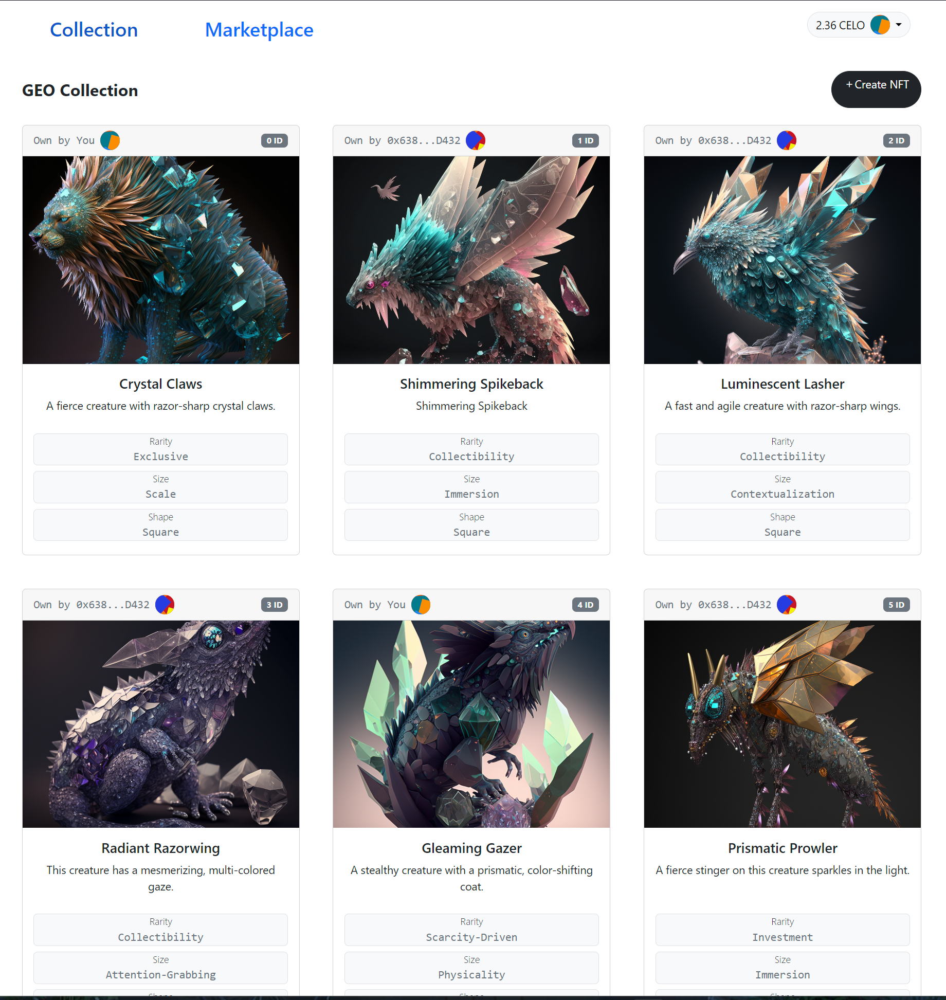
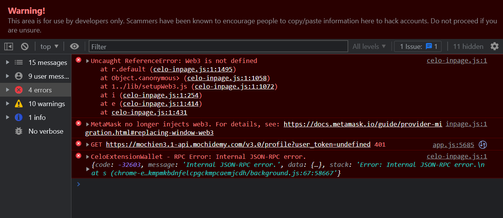

# NFT Collection
Live Demo: https://ganzzi.github.io/NFT-Collection



# Desciption
Welcome to NFT Collection, a web application enable user to create their own NFTs, also list NFTs into the marketplace to sell, update price, remove from the marketplace. This project was built as part of a coding challenge and serves as a showcase for my coding abilities.

# Feature
- Create new NFT collections and tokens
- Customize the metadata of the tokens (name, description, image, etc.)
- View your own tokens and collections, as well as those of other users
- Buy and sell tokens on the marketplace, with CELO as the currency
- Update and remove their own tokens from the marketplace
- Connect to a wallet (e.g., MetaMask) to interact with the Ethereum network

# Tech Stack
This web aplication uses the following tech stack:
- [Solidity](https://docs.soliditylang.org/) - A programming language for Ethereum smart contracts.
- [React](https://reactjs.org/) - A JavaScript library for building user interfaces.
- [use-Contractkit](contractkit
) - A frontend library for interacting with the Celo blockchain.
- [Hardhat](https://hardhat.org/) - A tool for writing and deploying smart contracts.
- [Bootstrap](https://getbootstrap.com/) - A CSS framework that provides responsive, mobile-first layouts.

# Usage
1. Install a wallet:
   - [CeloExtensionWallet](https://chrome.google.com/webstore/detail/celoextensionwallet/kkilomkmpmkbdnfelcpgckmpcaemjcdh?hl=en).
   - [MetamaskExtensionWallet](https://chrome.google.com/webstore/detail/metamask/nkbihfbeogaeaoehlefnkodbefgpgknn?hl=en).
2. Create a wallet.
3. Go to [https://celo.org/developers/faucet](https://celo.org/developers/faucet) and get tokens for the alfajores testnet.
4. Switch to the alfajores testnet in the CeloExtensionWallet.

# Test
1. Connect yor wallet to the app. Now you are in Collection section.
1. Create an NFT (fill out all informations: name, description, etc...).
2. Create a second account in your extension wallet and send them cUSD tokens.
3. List NFT: move into Marketplace section, click on the sell button, enter token id and price (token id of the NFT you own).
3. Buy NFT with secondary account.
4. Check if balance of first account increased.
5. Add another NFT, list into the marketplace.
7. Update the price of an NFT that you own.
8. Remove an product you own from the marketplace.

# Installation
To run the application locally, follow these steps:

1. Clone the repository to your local machine using: ``` git clone https://github.com/Ganzzi/NFT-Collection.git ```
2. Move into folder: ``` cd Street-Food-SaiGon ```
3. Install: ``` npm install ``` or ``` yarn install ```
4. Start: ``` npm start ```
5. Open the application in your web browser at ``` http://localhost:3000 ```

# Contributing
1. Fork this repository
2. Create a new branch for your changes: git checkout -b my-feature-branch
3. Make your changes and commit them: git commit -m "Add my feature"
4. Push your changes to your fork: git push origin my-feature-branch
5. Open a pull request to this repository with a description of your changes

Please make sure that your code follows the Solidity Style Guide and the React Style Guide. You can add tests for any new features or changes, also please make the front-end more friendly. I welcome any contributions or feedback on this project!

# Problems
1. The smart contract were not tested carefully (nft-test.js file).
2. The front-end with bootstrap framwork is quite unfriendly.
3. And there are some warnings and errors that I don't know how to fit:


